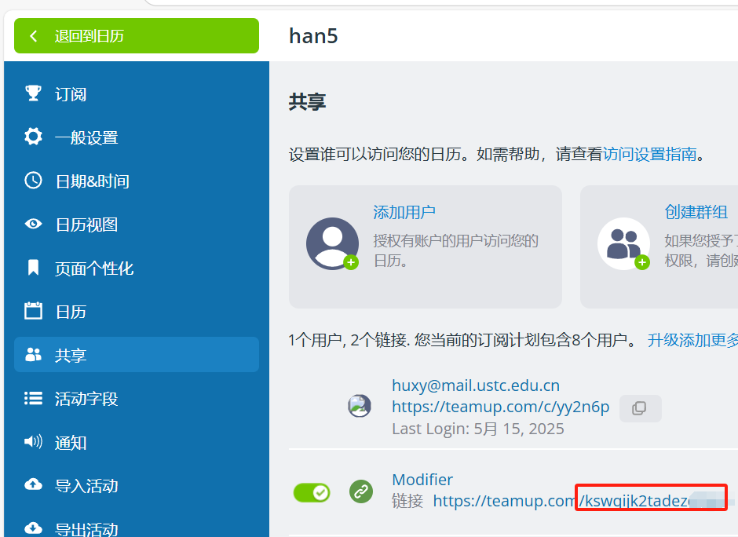

# GPU-Book-Monitor-LDS
This is a public version of LDS GPU Booksys.This version is special for web design explanation.
## Note:GUI Web Explanation

### Where is the web directory?
LDS-GPU-BookSys-Template/GPU-Calendar-Monitor-main/web

### script.js
- **teamup_calendar_id**: The ID of the Teamup calendar you want to monitor
- **subcalendarIds1**: The ID of the subcalendar you want to monitor

#### Key Configuration Explanation
- 
- **What is teamup_calendar_id?**
  - This is a string, such as 'kswqijk2tadxxxxx', representing the ID of the Teamup calendar you want to monitor, which corresponds to the GPU Calendar.
  
- **What is subcalendarIds?**
  - This is a number, such as '1348185', representing the ID of the subcalendar you want to monitor, which corresponds to a GPU.
 

Other configurations are the same as those in the Next Lab Monitor.

## the expected result

